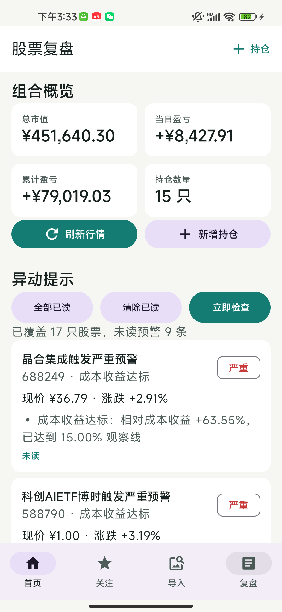

# 股票复盘 App

股票复盘 App 是一个面向个人投资者的 Android 本地应用，用于记录持仓、跟踪关注股票、查看监控预警、导入券商截图，并生成每日复盘内容。项目重点放在端侧数据闭环：本地持久化、行情刷新、预警监控、OCR 识别确认、交易操作记录和复盘生成。

## 技术栈

- Kotlin 2.0 + Java 17
- Jetpack Compose + Material 3
- Compose Navigation
- MVVM + ViewModel + StateFlow
- Coroutines + Flow
- Room + KSP，数据库 schema 导出
- Hilt 依赖注入
- Retrofit + OkHttp
- WorkManager 后台监控
- ML Kit Text Recognition Chinese
- Android Photo Picker
- JUnit 单元测试

Android 配置：

- `compileSdk 35`
- `targetSdk 35`
- `minSdk 26`

## 功能概览

### 首页

- 展示组合概览：总市值、当日盈亏、累计盈亏、持仓数量。
- 展示监控股票产生的异动预警。
- 预警排序规则：严重、警告、提示；同级按触发时间从新到旧。
- 支持一键全部已读、清除已读、立即检查。
- 已读预警弱化显示，便于区分新旧信息。



### 关注

- 将持仓股票和关注股票合并展示。
- 使用横向滚动表格呈现股票/市值、盈亏、成本/现价、持仓数量、当日盈亏、关注后涨幅、预警数量和行业。
- 未持仓但已关注的股票，持仓相关字段显示 `--`。
- 删除关注标的时，同步删除该股票已保存的预警。

### 个股工作台

- 从关注表格点击股票进入个股工作台。
- 展示行情、持仓指标、关注信息、监控状态、预警列表和操作记录。
- 支持进入监控设置。
- 支持清除当前股票已读预警。
- 支持新增买入/卖出操作。

### 交易操作记录

- 支持记录买入、卖出、数量、价格、日期时间和备注。
- 手续费固定按成交额万一计算。
- 买入后自动同步持仓数量，并按买入金额和手续费重算成本价。
- 卖出时校验可用持仓数量，记录已实现盈亏。
- 清仓后自动删除持仓。
- 当前版本暂不支持编辑或删除历史操作，避免持仓回滚逻辑复杂化。

### 持仓管理

- 支持新增、编辑和删除持仓。
- 输入 6 位股票代码后自动查询名称和行情。
- 行情查询失败时可手动输入名称和现价。
- 本地缓存行情，弱网或接口失败时继续展示已有数据。

### 股票监控

- 支持按股票配置监控规则。
- | 规则 | 触发条件 | 权重 |
  |------|----------|------|
  | **成本百分比** | 盈利+15% / 亏损-12% | ⭐⭐⭐ |
  | **日内涨跌幅** | 个股±4% / ETF±2% / 黄金±2.5% | ⭐⭐ |
  | **成交量异动** | 放量>2倍均量 / 缩量<0.5倍 | ⭐⭐ |
  | **均线金叉/死叉** | MA5上穿/下穿MA10 | ⭐⭐⭐ |
  | **RSI超买超卖** | RSI>70超买 / RSI<30超卖 | ⭐⭐ |
  | **跳空缺口** | 向上/向下跳空>1% | ⭐⭐ |
  | **动态止盈** | 盈利10%+后回撤5%/10% | ⭐⭐⭐ |
- 支持成本收益/亏损、日内涨跌、量能、均线、RSI、跳空和动态止盈等预警类型。
- WorkManager 定期执行后台检查。
- 支持手动立即检查。
- 严重和警告级别预警会发送系统通知；提示级别只在 App 内展示。
- Android 13+ 未授权通知时，首页会显示“开启通知”入口。

### 内置个人数据

- 可在本地维护 `app/src/main/assets/personal_portfolio.local.json`。
- 启动时会补充数据库里还没有的股票，不覆盖 App 内已有持仓、关注和监控配置。
- 支持初始化持仓、关注股和监控配置。

### OCR 截图导入(todo 还没完成)

- 使用系统 Photo Picker 选择券商持仓截图。
- 使用 ML Kit 中文 OCR 识别截图文字。
- OCR 结果先生成可编辑草稿，用户确认后才写入正式持仓。

### 每日复盘

- 根据持仓和预警生成本地复盘文案。
- 支持保存复盘记录。
- 支持复制复盘文案和 AI 润色 Prompt。

## 架构

项目采用分层结构：

- 表现层：Compose 页面、Navigation、ViewModel、StateFlow。
- 业务层：UseCase，负责组合计算、行情刷新、预警检查、OCR 解析和复盘生成。
- 数据层：Repository 统一协调 Room、远程行情、K 线、OCR 草稿和复盘记录。
- 基础设施：Room、Retrofit/OkHttp、WorkManager、Hilt、ML Kit。
- 数据库升级坚持显式迁移，不使用破坏性迁移清库。

更多说明见 [docs/ARCHITECTURE.md](docs/ARCHITECTURE.md)。

## 运行方式

1. 安装 Android Studio，并确保可使用 JDK 17。
2. 使用 Android Studio 打开项目根目录。
3. 等待 Gradle 同步完成。
4. 运行到 Android 模拟器或真机。

常用命令：

```powershell
.\gradlew.bat assembleDebug
.\gradlew.bat testDebugUnitTest
```

## 文档

- [架构设计](docs/ARCHITECTURE.md)
- [项目说明](docs/PROJECT_OVERVIEW.md)
- [手动测试清单](docs/MANUAL_TEST_CHECKLIST.md)
- [个人数据 JSON 模板](docs/personal_portfolio.example.json)

## 边界说明

- 行情接口用于个人学习和辅助观察，不保证稳定性。
- 预警、复盘和统计内容不构成投资建议。
- 应用不接入券商账户，不支持真实交易、自动下单或云同步。
